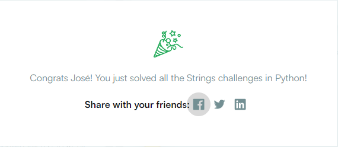
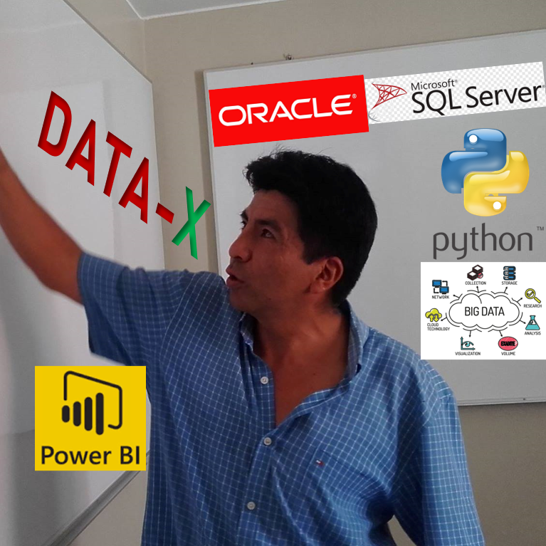

# <h1 align=center style="color: lightgreen; font-weight: bold; text-shadow: 1px 1px 2px #000;"> **MY PYTHON DEV REPO** </h1>

  

# ***PRACTICE FILES***

## DIFFICULT LEVELS

- <a href="https://github.com/jalcantara777/HackerRank/tree/main/Basic">Basic</a>

- <a href="https://github.com/jalcantara777/HackerRank/tree/main/Medium">Medium</a>

# ***AWARDS***

# ***CONTACT***
- Name: José Alcántara 
 

- Mail: jalcantara777@yahoo.com
 

